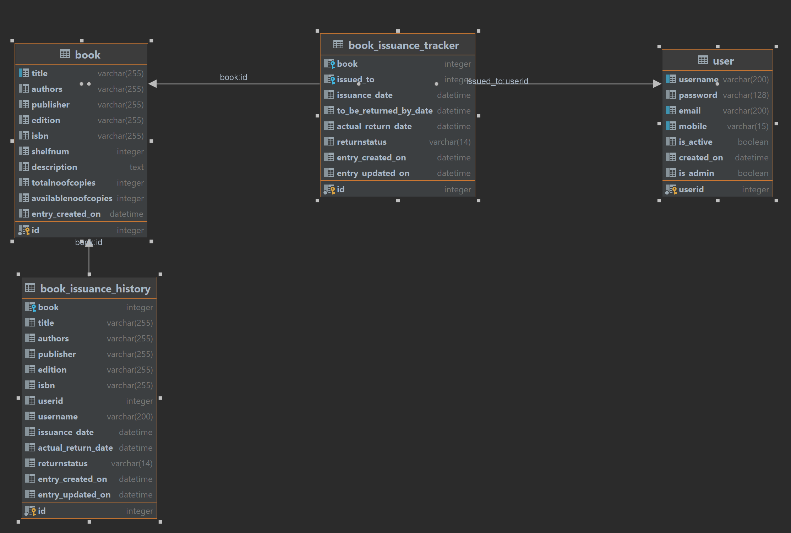

# LMS

  Access to admin user links is restricted to users with isAdmin flag as 1  ( librarian)

  Once all copies of a book are issued, the issue book drop down will not show any book to issue till any books are returned.

New Features - 29-04-2023
-------------
1. Login with selecting username from dropdown
2. Two separate views for librarian login and normal member login
3. Normal member Menus-
    View Current Issued Books
    View History
    Update user details/ Change Password
4.  Librarian can also update user details and passwords from the list members menu
5.  Only Normal members are listed in the book issue dropdown

------------------------------------------

When Book is issued the " to be returned by date" is set to today + 7 days.
When renew option is set then the " to be returned by date" is set to today + 7 days
The date is extended.

-------------------------------------------

When the book is returned the available copy of the book is incremented and the copy is available for issue again
If all the copies of the book are issued then it won't appear in the available for issue list
This is managed using the available copy column in the book data model

--------------------------------------------
Flask  framework is used
https://flask.palletsprojects.com/en/2.3.x/

https://jinja.palletsprojects.com/en/2.10.x/
is the template engine

https://flask-login.readthedocs.io/en/latest/
is used for authentication

https://flask-bcrypt.readthedocs.io/en/1.0.1/
is used for generating password hash

https://wtforms.readthedocs.io/en/3.0.x/
is used for forms

https://flask-sqlalchemy.palletsprojects.com/en/3.0.x/
is used for DB access

https://flask-alembic.readthedocs.io/en/latest/
is used for DB migrations

https://flask.palletsprojects.com/en/2.2.x/blueprints/
The application is structured using blueprints

https://www.sqlite.org/index.html
The database used is sqlite
The config.py file has the connection properties.

-------------------------------------------

UI
https://getbootstrap.com/
bootstrap is used for frontend styling 

----------------------------------------------
For DB:
open App.db file in https://sqlitebrowser.org/

Librarian
Userid : 1
password : April@2023

Once user table is empty, the first created user is made as librarian.

or You can update the is_Admin column in User table in db for making the user as librarian

Normal Member
User Id 2: 
password: April@2023

User can do self registration or Librarian can add users [ Name, Mobile and Email  should be distinct for each user]

But only Librarian can access Library dashboard

______________________________________________________________________________________

SQLite DB is used

Delete SQLite DB and can start fresh

Steps to create a new db

1.  flask db init

2.  flask db migrate -m "Initial migration."

3.  flask db upgrade

-------------------------------------------------------------------------------------------

To run : 
Go to the folder
Open CMD
and run
pip install -r requirements.txt

This will install the libraries/ dependencies

----------------------------------------------------------------------------------------------

To run:

Then in the root folder of the project

open cmd and type:    flask run

--------------------------------------------------------------------------------------------

 